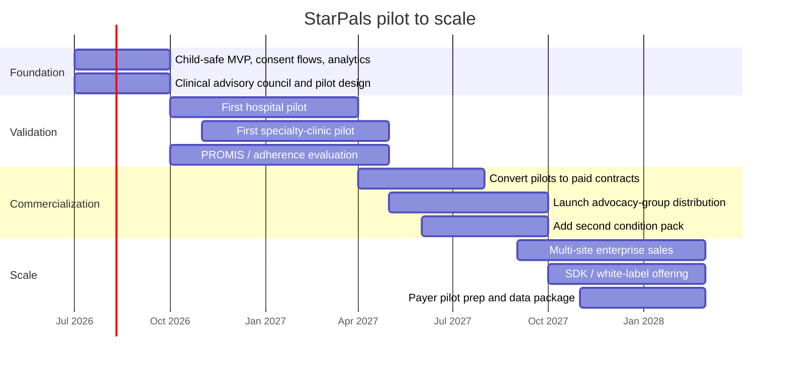

# StarPals Deep Y Combinator Style Analysis

## Executive summary

StarPals is credible as a venture-scale company if it is framed correctly: not as a medication reminder app, not as a generic pediatric wellness tracker, and not as a child social network, but as a **child-facing engagement layer for pediatric chronic care** that sits between the care plan and the child’s daily life. The underlying problem is large and persistent. HRSA’s 2022–2023 National Survey of Children’s Health found that **26.2% of U.S. children—more than 19 million—have a special health care need**, and these children are less likely to flourish, less likely to have no difficulty making friends, and less likely to have caregivers reporting strong coping and mental health than peers without special health care needs. Only **39.3%** of children and youth with special health care needs received care in a medical home, and only **13.0%** received care in a well-functioning system on HRSA’s six-component definition. citeturn4view0turn5view1

The market thesis is not that kids need more information. It is that **kids need motivation, identity, and belonging**, while caregivers and clinicians need lightweight visibility between visits. Pediatric psychology guidance is blunt on the adherence problem: among youth with chronic conditions, roughly **50% of children and 65%–90% of adolescents do not consistently adhere** to medical regimens, adherence can fall as early as six months after diagnosis, and **behavioral or multicomponent interventions outperform education alone**. The same guidance explicitly points to technology-based programs as a practical way to disseminate adherence support. citeturn26view0

That makes StarPals’ proposed product wedge strategically sound. The uploaded PRD already defines a compelling “golden path” centered on **Care Cards, Stardust rewards, pet care/evolution, community quests, safe encouragement, AI-generated stories, and a gentle caregiver recap**—all of which align with the behavioral drivers the literature says matter more than reminders alone. fileciteturn0file0 citeturn26view0

Commercially, the strongest structure is **a venture-backed core company with a grant-friendly research and access layer**, rather than a purely nonprofit structure. The platform can monetize through a blend of **B2C freemium subscriptions, B2B pediatric provider licensing, grants/philanthropy, payer or advocacy partnerships, and SDK/white-label licensing**. Under the explicit assumptions in this report, the base case reaches about **$11.6 million** in Year 5 revenue, crosses operating break-even in Year 4, and yields an indicative **NPV of roughly $5.1 million** at an 18% discount rate. The optimistic case is meaningfully larger; the stress case is negative, which is exactly what a serious startup model should show. The implication is straightforward: StarPals is not “obviously huge” by default, but it is **economically believable if it wins enterprise distribution early and uses B2C primarily as engagement proof, not as the only revenue engine**. citeturn4view0turn26view0

The single biggest investor message is this: **StarPals is building the daily habit layer for pediatric chronic care**. If that layer works, it can expand across asthma, diabetes, cystic fibrosis, inflammatory bowel disease, rehabilitation, behavioral health routines, post-discharge recovery, and eventually pediatric payer and care-management workflows. That is a much bigger company than “gamified meds.”

## Problem research and why this matters

The strongest primary-source foundation for this business is the size and fragility of the target population. HRSA’s latest NSCH brief reports that **more than one in four U.S. children have a special health care need**, and the survey’s definition explicitly includes recurring needs such as prescription medications, elevated medical or mental-health service use, functional limitations, special therapies such as physical, occupational, or speech therapy, and developmental or behavioral problems requiring treatment or counseling. In other words, the dataset is already capturing the exact kinds of ongoing routines that StarPals is meant to support. citeturn4view0

The quality-of-life gap is also stark. Among school-aged children, HRSA reports that compared with peers without special health care needs, children and youth with special health care needs have lower **school engagement** and are much less likely to report **no difficulty making or keeping friends**. HRSA also reports a major gap in **flourishing**, a construct tied to curiosity, resilience, and self-regulation. That matters because StarPals is not just trying to increase task completion; it is trying to preserve identity and belonging in a population whose social and emotional well-being is already under strain. citeturn4view0turn5view1

The caregiver and system burden makes the same point from another angle. HRSA found that caregivers of children with special health care needs were less likely to report excellent or very good mental health, less likely to say they were coping very well with day-to-day parenting demands, and more likely to report employment impacts, care-coordination burden, and difficulty paying medical bills. At the system level, only **39.3%** of these children received care in a medical home, and only **13.0%** received care in a well-functioning system of care. That gap between what the care plan requires and what daily life can support is the operating room in which StarPals lives. citeturn4view0

Pediatric psychology literature supports the behavioral side of the thesis. The Society of Pediatric Psychology states that nonadherence is common and persistent in childhood chronic disease, with adherence often declining within six months of diagnosis. It also notes that adherence is shaped by individual, family, community, and health-system factors—including **peer support** and **patient-provider communication**—and that **behavioral and multicomponent interventions are more effective than education alone**. The same fact sheet highlights technology-based programs as a route to broader access. That maps unusually well to StarPals’ design: a behavioral, multicomponent intervention that combines routine completion, caregiver support, clinician visibility, and peer-adjacent encouragement in one product. citeturn26view0

For measurement, NIH’s PROMIS program is relevant because it formalized standardized, patient-reported outcome measures across **pain, fatigue, physical functioning, emotional distress, and social role participation**, and it explicitly developed pediatric measures. NIH describes PROMIS as more efficient and sensitive than many older PRO approaches and notes growing use in both research and clinical settings. That gives StarPals a credible pathway to pilot evaluation using accepted symptom and well-being measures instead of vanity metrics alone. citeturn50view0

Two preliminary research notes that accompanied the request are directionally important but should be handled carefully in any investor-facing deck. Those notes referenced a **2024 Frontiers in Pediatrics** study on post-hospitalization mental-health diagnoses and a **2024 JAMA randomized trial** on pediatric symptom screening and care pathways. I was **not able to independently retrieve and verify those exact papers in this pass**, so I would treat those two study-specific effect sizes as placeholders until a formal literature audit is completed. They are plausible and strategically relevant, but they should not be quoted externally without verification.

## Solution fit and Y Combinator style positioning

The clean YC positioning is:

**StarPals is Duolingo meets Tamagotchi for pediatric chronic care: a child-native engagement layer that turns daily care tasks into progress, story, and belonging.**

That framing is powerful because it names both the wedge and the moat. The wedge is not clinical decision support, claims processing, or telehealth. It is the **daily behavior layer** that health systems, parents, and disease-specific apps routinely fail to solve. The moat, if the product works, is an unusually sticky combination of **child attachment, caregiver workflow, clinician visibility, and condition-agnostic content architecture**. citeturn26view0

The product concept in the uploaded PRD is already very close to the right answer. It positions StarPals around **Care Cards** for recurring actions such as medication, hydration, PT, breathing, mood, rest, or appointment tasks; **Stardust** as the reward currency; **pet care/evolution** as the emotional payoff; **community quests** as a safe, non-competitive belonging mechanic; **prewritten encouragements** rather than open chat; **AI-generated stories** for delight; and a **gentle parent dashboard** rather than a surveillance dashboard. That is the correct product architecture because it transforms “adhere to treatment” into “care for a creature and contribute to a world.” fileciteturn0file0

From a behavior-design standpoint, StarPals solves the problem in four ways that conventional pediatric apps usually do not. First, it **reframes the child’s role** from patient to hero/caretaker. Second, it **reduces parent-child conflict** by externalizing routines into the game loop. Third, it creates **social proof without unsafe disclosure** through aggregated or preset community interactions. Fourth, it gives clinicians and caregivers **lighter-weight between-visit signal** without requiring the child to behave like a miniature adult case manager. Those mechanisms are consistent with the pediatric self-management literature’s emphasis on family, community, and systems factors rather than pure education. citeturn26view0

The highest-value feature set for the first real product remains the same as the hackathon “golden path”: onboarding, pet selection, today’s quest, completion rewards, pet evolution, community progress, safe encouragement, story generation, and caregiver recap. The company will fail if it overbuilds disease-specific workflow too early. It will win if it proves one narrow claim first: **children voluntarily come back to this experience and complete more routine-supporting actions with less caregiver friction**. fileciteturn0file0

A useful way to think about StarPals is that it is **the pediatric equivalent of an engagement API for chronic care**. In the long run, the company may sell disease modules, analytics, care-team views, and licensing. But the product truth must remain simple: it helps a child do hard, repeated things without feeling reduced to a diagnosis.

## Market size and customer wedge

This market is best sized **bottom-up**, not by citing a generic digital-health market report. The anchor population is HRSA’s estimate of **more than 19 million U.S. children with special health care needs**. For StarPals’ initial wedge, I assume the primary product target is ages **7–13**, which is **7 out of 18 pediatric years**, or **38.9%** of the 0–17 population. That yields an estimated **7.4 million** age-appropriate U.S. children in the core demographic. I then apply a modeled **70% “routine-heavy” filter** to reflect kids with recurring medication, therapy, symptom, hydration, breathing, mood, or appointment tasks that map cleanly to StarPals’ game loop. That produces a U.S. B2C launch SAM of roughly **5.2 million** children. The percentage filters below are assumptions, not sourced facts. The population base is sourced to HRSA. citeturn4view0

### U.S. market sizing

| Segment | Method | Population / accounts | Monetization assumption | Annual revenue opportunity |
|---|---:|---:|---:|---:|
| **B2C TAM** | 19.0M CYSHCN × 38.9% target age | 7.39M children | $96 net annual premium ARPU | **$709M** |
| **B2C SAM** | B2C TAM × 70% routine-heavy fit | 5.17M children | $96 net annual premium ARPU | **$496M** |
| **B2C SOM** | B2C SAM × 1.0% reachable in Year 5 | 51.7K paid families | $96 net annual premium ARPU | **$5.0M** |
| **B2B TAM** | Modeling assumption: 200 pediatric systems + 1,000 pediatric specialty/therapy clinics | 1,200 accounts | $250K/system, $40K/clinic | **$90M** |
| **B2B SAM** | Focused launch: 50 large systems + 200 specialty clinics | 250 accounts | same pricing | **$20.5M** |
| **B2B SOM** | Year 5 reachable: 12 systems + 40 clinics | 52 accounts | blended ACV in model | **$4.6M–$5.0M** |

**Interpretation.** The near-term U.S. monetizable TAM is roughly **$800M–$900M annually** before layering in grants, payer partnerships, or SDK licensing. This is not a trillion-dollar social app market. It is a serious, focused, high-need market where enterprise distribution can matter as much as consumer virality. citeturn4view0

The best customer wedge is not “all pediatric chronic illness.” It is:

**children with recurring daily or near-daily care routines, where caregiver friction is high, the child can interact with a mobile device, and the provider has reason to care about at-home engagement between visits.**

That naturally points to condition lanes such as asthma, diabetes, cystic fibrosis, inflammatory bowel disease, sickle cell disease, rehabilitation/PT, behavioral-health routines, and post-discharge recovery. The product should enter through one or two lanes, not seven.

## Business model and financial outlook

The right legal and strategic recommendation is **commercial core, mission-aligned access layer**.

A pure nonprofit can attract grants and trust, but it will struggle to build a durable product platform, invest in enterprise integrations, recruit top product talent, and move with startup speed. A pure consumer-subscription company, on the other hand, risks pushing too hard toward affluent households and “cute app” positioning. The strongest answer is a **for-profit, preferably mission-locked entity such as a public-benefit corporation**, paired with grant-funded research, access programs, or a fiscal-sponsor/nonprofit partnership for pilots in Medicaid-heavy or underserved settings. That keeps the company venture-legible while preserving eligibility for philanthropic and academic collaboration.

### Revenue architecture

| Stream | What it sells | Why it matters strategically |
|---|---|---|
| **B2C freemium** | Free core app, premium stories/customization/caregiver insights | Proves engagement and creates parent pull |
| **B2B hospital / clinic licensing** | Platform fee plus implementation and cohort-based usage | Most efficient distribution and strongest unit economics |
| **Grants / nonprofit funding** | Research pilots, underserved access, post-discharge programs | Lowers dilution and de-risks early clinical validation |
| **Strategic partnerships** | Advocacy campaigns, payer pilots, sponsored condition journeys | Faster trust and channel access |
| **SDK / white-label licensing** | Quest engine, companion loops, child UX layer for other pediatric products | High-margin long-term upside |

### Pricing scenarios

| Offer | Conservative | Base | Premium / enterprise |
|---|---:|---:|---:|
| **B2C premium** | $59/year | **$79–$99/year** | $119/year family bundle |
| **Hospital pilot** | $60K–$100K/year | **$120K–$180K/year** | $250K+ with integrations |
| **Specialty clinic / therapy group** | $18K/year | **$36K–$45K/year** | $60K+ multi-site |
| **SDK / white-label** | $50K license | **$100K–$150K** | Custom enterprise pricing |

The investor-important point is that **B2C should not bear the valuation story alone**. B2C proves engagement and creates data/network effects. **B2B is what pays the bills.**

### Five-year base-case revenue model

All figures below are explicit model assumptions, expressed in U.S. dollars.

| Year | B2C freemium / premium | B2B hospital & clinic | Grants / nonprofit | Partnerships | SDK / licensing | **Total revenue** |
|---|---:|---:|---:|---:|---:|---:|
| **Year 1** | 0.05M | 0.12M | 0.55M | 0.03M | 0.00M | **0.75M** |
| **Year 2** | 0.25M | 0.75M | 0.60M | 0.25M | 0.06M | **1.91M** |
| **Year 3** | 0.80M | 2.00M | 0.50M | 0.45M | 0.38M | **4.13M** |
| **Year 4** | 2.00M | 3.70M | 0.35M | 0.65M | 0.55M | **7.25M** |
| **Year 5** | 4.60M | 4.90M | 0.25M | 0.95M | 0.90M | **11.60M** |

This is a deliberately blended model. The point is not that grants remain dominant. The point is that non-dilutive capital is highly rational in Year 1–2 while the company proves product efficacy and enterprise readiness.

### Unit economics

| Metric | B2C base | Hospital-system base | Specialty clinic base |
|---|---:|---:|---:|
| **Net annual revenue per account** | $96 | $180,000 | $40,000 |
| **Gross margin** | 82% | 85% | 85% |
| **CAC** | $70 | $45,000 | $12,000 |
| **Logo retention** | 72% | 90% | 88% |
| **Implied LTV** | ~$281 | ~$1.53M | ~$283K |
| **LTV / CAC** | **4.0x** | **34x** | **24x** |
| **Gross-margin payback** | ~11 months | ~4 months after close | ~4 months after close |

The enterprise economics are excellent on paper, which is normal for B2B health-tech. The real constraint is not margin; it is **sales friction, privacy review, procurement cycles, clinical championing, and integration burden**. That is why the company should initially sell to a narrow set of pediatric innovators instead of trying to cover every hospital type at once.

### Discounted cash flow and NPV

Early-stage DCF is inherently fragile, but it is still useful as a plausibility test. I used these modeling assumptions:

| Case | Discount rate | Terminal growth | Notes |
|---|---:|---:|---|
| **Base** | 18% | 3% | Seed-stage digital health with moderate execution risk |
| **Optimistic** | 16% | 4% | Strong pilot conversion and faster enterprise adoption |
| **Stress** | 22% | 2% | Slower adoption, weaker retention, higher selling friction |

| Case | Year 1 FCF | Year 2 FCF | Year 3 FCF | Year 4 FCF | Year 5 FCF | Terminal value PV | **Indicative NPV** |
|---|---:|---:|---:|---:|---:|---:|---:|
| **Base** | -1.85M | -1.70M | -0.85M | 0.55M | 2.35M | 7.06M | **5.1M** |
| **Optimistic** | -1.60M | -1.00M | 0.30M | 2.40M | 5.60M | 23.1M | **25.1M** |
| **Stress** | -2.00M | -1.90M | -1.40M | -0.60M | 0.40M | 0.76M | **-3.1M** |

### Sensitivity

| Variable change vs. base | Indicative effect on NPV |
|---|---:|
| **Adoption rate -25%** | falls to roughly **0.6M** |
| **Adoption rate +25%** | rises to roughly **9.4M** |
| **Net B2C ARPU -20%** | falls to roughly **2.1M** |
| **Net B2C ARPU +20%** | rises to roughly **8.0M** |
| **B2C retention -10 points** | falls to roughly **2.9M** |
| **B2C retention +10 points** | rises to roughly **7.1M** |
| **CAC +25%** | falls to roughly **4.2M** |
| **CAC -25%** | rises to roughly **5.9M** |
| **Discount rate 22%** | falls to roughly **3.6M** |
| **Discount rate 15%** | rises to roughly **6.9M** |

The most important conclusion from the sensitivity table is that **adoption and retention matter much more than shaving a few points of CAC**. This is a product-led outcome business, not a performance-marketing business.

### Break-even and runway

At a blended gross margin of roughly **85%**, and fixed operating expense of about **$5.4 million** in the scale-up phase, operating break-even occurs at approximately **$6.3 million annual revenue**. The base case crosses that line in **Year 4**. A pure-B2C path would need around **66,000 paid families at $96 net ARR** to reach that threshold. A pure-B2B path would need roughly **29 pediatric systems at $220K ACV**. A hybrid mix is far more realistic. citeturn26view0

For capital planning, the cumulative negative free cash flow through Year 3 in the base case is roughly **$4.4 million**. With a prudent buffer for compliance, sales-cycle lag, and integration costs, the practical capital need to approach break-even is closer to **$5.0M–$5.5M**. A **$3.5 million seed round** plus **$0.5M–$0.75M in non-dilutive grant support** would likely provide about **20–22 months of runway**, which is enough to prove pilot retention, enterprise conversion, and child-safe engagement.

## Go-to-market, growth, and strategic partnerships

The best go-to-market strategy is **institution-led distribution first, parent pull second**.

The mistake would be trying to launch StarPals as a standalone consumer app and buying installs. The better path is to let **trusted pediatric institutions prescribe the companion experience** into existing care moments: diagnosis onboarding, discharge, therapy plan starts, respiratory or diabetes education, rehabilitation programs, and behavioral-health routines. This distribution logic matches the HRSA evidence showing a weakly functioning system of care and a large coordination burden on families. StarPals wins by becoming the missing home-use interface, not by competing with entertainment apps in the App Store. citeturn4view0

### Recommended channel sequence

**First channel:** children’s hospitals, pediatric specialty clinics, therapy/rehab groups, and child-life or care-management teams.

**Second channel:** condition-specific advocacy groups and family nonprofits, especially organizations already trusted by parents who live with recurring routines.

**Third channel:** payer pilots, beginning with Medicaid-focused or pediatric-heavy plans only after outcome data exists.

**Fourth channel:** direct-to-parent subscription growth, but primarily as a complementary motion once clinical credibility is established.

### Growth tactics that fit the product

The growth loop should be built around **prescription, not advertising**. The simplest high-leverage tactic is a **QR-based “start your StarPal today” workflow** handed out at pediatric visits or discharge. Families should be able to enroll in under three minutes, with zero diagnostic detail required on the child side. The parent or care team configures the child’s recurring Care Cards; the child sees only the quest flow. That is both safer and more scalable. fileciteturn0file0

A second strong loop is the **care-team starter pack**: a provider launches a 6-week StarPals quest pack for asthma, diabetes, rehab, or post-discharge recovery. This sharply improves enterprise sales because buyers are purchasing a named program, not an abstract app.

A third loop is the **advocacy-group co-branded challenge**, where a trusted nonprofit helps acquire families through webinars, camp programs, support groups, or family education packets. This matters because the audience is medically and emotionally sensitive; institutional trust compounds.

### Strategic partnership map

| Partner type | Why they matter | Target examples |
|---|---|---|
| **Children’s hospitals / pediatric systems** | Distribution, pilots, clinician champions, outcomes data | top pediatric innovation centers, child-life teams, rehab units |
| **Pediatric specialty clinics** | Faster sales cycle, clearer ROI, narrower condition packs | diabetes, pulmonology, GI/IBD, cystic fibrosis, rehab/PT |
| **Patient advocacy groups** | Trust, community access, content co-design, equity reach | disease-specific foundations, family support charities |
| **Insurers / Medicaid MCOs** | Long-term reimbursement or population-health expansion | pediatric-heavy plans after pilot outcomes |
| **Schools / after-school / camps** | Optional engagement layer, social belonging, recovery support | school nurses, medically supported camps, post-discharge learning support |
| **EHR / digital health vendors** | White-label distribution and SDK revenue | pediatric portals, remote-monitoring vendors, rehab tools |

### Twenty-four month pilot to scale timeline

## Privacy, regulatory posture, and validation plan

The most important regulatory truth is that **StarPals is easier to build and sell if it stays out of medical-device territory**. It should not diagnose, recommend treatments, or claim to improve specific clinical outcomes until those claims are studied. It should present itself as a **behavioral engagement and support platform configured by caregivers and care teams**. The FTC’s COPPA rule applies to child-directed online services and to operators with actual knowledge that they are collecting personal information from children under 13. That means StarPals needs parental consent, data minimization, and strong defaults from day one if it is directed to children. citeturn44view0

HIPAA needs equally careful framing. HHS explains that the HIPAA Privacy Rule governs protected health information used by covered entities and business associates, and HHS’s health-app guidance makes clear that different federal rules can apply depending on how an app collects or receives data. If StarPals is sold to a hospital and handles PHI on that hospital’s behalf, it likely becomes a **business associate** with HIPAA obligations. If it operates as a standalone consumer app outside a covered entity relationship, HIPAA may not apply in the same way, but the company may still face the **FTC Act, the FTC Health Breach Notification Rule, and COPPA**. In practice, this means the company should architect the platform to meet a high privacy bar regardless of channel. citeturn47view0turn48view0turn44view0

### Recommended privacy and compliance stance

The product should store **the minimum necessary data** on the child side, avoid public diagnosis display entirely, prohibit free-text child-to-child communication, and keep peer connection limited to **preset messages, aggregate mood/state displays, and anonymous community progress**. The hospital product should be separated from the child-facing experience by role-based access, parent controls, and audit logs. The hospital version should use a business associate agreement and HIPAA-ready architecture; the consumer version should assume FTC/COPPA scrutiny even when HIPAA is not triggered. citeturn47view0turn48view0turn44view0

### Suggested pilot study design

The first serious validation study should be **pragmatic and behavioral**, not overpromised as a clinical outcomes trial.

A strong design would be a **6–12 week pilot** at one children’s hospital plus one specialty clinic, enrolling **100–150 families** with recurring routines. Measure:

| Domain | Example metric | Why it matters |
|---|---|---|
| **Feasibility** | activation rate, time to first quest, weekly active use | shows real-world usability |
| **Engagement** | D7, D30 retention; quests completed per active child | demonstrates habit formation |
| **Care behavior** | routine completion vs. baseline or matched comparison | direct value proposition |
| **Caregiver burden** | parent-reported conflict / nagging reduction | likely strongest early ROI story |
| **Child well-being** | validated PROMIS pediatric measures in emotional/social domains | guard against “engagement at any cost” |
| **Safety** | privacy incidents, moderation incidents, inappropriate content rate | essential for child trust |
| **Enterprise value** | pilot-to-paid conversion, clinician usage of recap dashboard | commercialization signal |

NIH’s PROMIS measures are especially useful here because they cover exactly the cross-condition symptom and well-being domains StarPals cares about and are built for standardized patient-reported assessment, including pediatric populations. citeturn50view0

## Risks, mitigations, and open questions

The biggest product risk is **building an adorable app that does not materially change behavior**. The mitigation is to keep the product focused on recurring routines, not broad “wellness,” and to evaluate against real behavioral outcomes rather than only retention or sentiment.

The biggest business risk is **slow enterprise sales**. The mitigation is to sell **named programs** into narrow use cases first—such as post-discharge recovery, rehab/PT routines, or a specific disease pack—rather than pitching a broad pediatric platform on day one.

The biggest ethical risk is **unsafe child social design**. The mitigation is to prohibit free text, prohibit public diagnosis-sharing, use parent gates and role separation, and default to minimum data collection. That aligns with COPPA and with the practical standards HHS and FTC signal for child- and health-related apps. citeturn44view0turn48view0

The biggest strategic risk is **mis-positioning**. If StarPals is pitched as “gamified meds,” the market will hear a feature. If it is pitched as “the daily engagement layer for pediatric chronic care,” the market will hear a company.

### Open questions and limitations

Two evidence claims from the preliminary notes supplied with this request were not independently verified during this research pass: the cited **2024 Frontiers in Pediatrics** hospitalization/mental-health study and the cited **2024 JAMA** pediatric symptom-screening randomized trial. I would add those exact papers before using their effect sizes in an investor memo or pilot protocol.

Provider-universe counts used for the B2B TAM/SAM/SOM model are **explicit assumptions**, not fully sourced census data. The patient-population side of the model is strongly grounded in HRSA. The provider side should be tightened during GTM planning with a target-account list.

The core thesis still holds without those refinements: there is a large, high-need pediatric chronic-care population, a measurable adherence and caregiver-friction problem, clear evidence that behavioral and multicomponent interventions outperform education alone, and a pragmatic revenue path if StarPals wins institution-led distribution. citeturn4view0turn26view0turn50view0